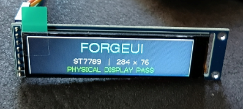

# ForgeUI Hardware Lab — ST7789 284×76 Wide Display

A physically tested ESP32-S3 hardware reference for the **2.25-inch ST7789 76×284 SPI TFT display**. This official ForgeUI Hardware Lab project preserves the known-good **284×76 landscape** configuration physically proven on real hardware.

ForgeUI is developed by [RTechAI](https://github.com/RTechAI). This repository is maintained as part of the ForgeUI Hardware Lab and provides the golden ESP32/ST7789 284×76 baseline on which related ForgeUI hardware showcases can build.

Hardware Lab validation proves this display configuration; it does not by itself indicate that this hardware target is currently integrated into ForgeUI Studio.

**ForgeUI:** https://forgeui.co.nz
**ForgeUI Hosted Studio:** https://studio.forgeui.co.nz

---

## Physical Hardware Proof

**PHYSICAL DISPLAY PASS — ESP32-S3 + ST7789 2.25" 76×284 TFT**

---

## Physical Hardware Status

**PHYSICAL DISPLAY PASS**

Tested on real hardware on **19 September 2026**.

The display successfully:

- Initializes from an ESP32-S3
- Communicates over SPI
- Renders full-screen colours
- Renders text and graphics
- Operates at its native 76×284 resolution
- Operates as a 284×76 landscape display
- Runs at 27 MHz SPI
- Builds and flashes successfully using PlatformIO

This repository records the known-good hardware configuration before future LVGL and ForgeUI Studio integration work.

---

## Hardware

### ESP32

**ESP32-S3 DevKitC-1**

Physical device detection during flashing confirmed:

- ESP32-S3
- Silicon revision v0.2
- 8 MB embedded PSRAM
- 40 MHz crystal

### TFT Display

- Controller: **ST7789**
- Display size: **2.25 inch**
- Native resolution: **76×284**
- Landscape viewport: **284×76**
- Interface: **SPI**
- Display type: IPS colour TFT

---

## Physically Proven Wiring

| TFT Display | ESP32-S3 | Function |
|---|---:|---|
| GND | GND | Ground |
| VCC | 3.3V | Display power |
| SCL | GPIO 12 | SPI clock |
| SDA | GPIO 11 | SPI MOSI |
| RST | GPIO 10 | Display reset |
| DC | GPIO 9 | Data / command |
| CS | GPIO 8 | Chip select |
| BL | GND | Backlight enable |

### Backlight

The physically tested display module uses an **active-low backlight input**.

The proven configuration is:

    BL -> GND

This enables the backlight on the tested module.

Other ST7789 modules may use different backlight circuitry, so this should not be assumed to apply to every ST7789 display.

---

## Proven Display Configuration

    Controller: ST7789
    Native resolution: 76 x 284
    Landscape viewport: 284 x 76
    SPI frequency: 27 MHz
    MOSI: GPIO 11
    SCLK: GPIO 12
    CS: GPIO 8
    DC: GPIO 9
    RST: GPIO 10
    MISO: Not used
    BL: GND / active-low
    Display inversion: false
    Landscape rotation: 1

---

## Software

The initial physical bring-up uses:

- PlatformIO
- Arduino framework for ESP32
- TFT_eSPI-compatible ST7789 76×284 display support

The initial project is deliberately small and deterministic.

Its purpose is to establish a **known-good physical hardware baseline** before introducing LVGL, sensors, application logic or ForgeUI Studio integration.

Third-party libraries and dependencies remain subject to their respective licences.

---

## ForgeUI Hardware Lab

ForgeUI Hardware Lab is an RTechAI/ForgeUI collection of physically tested ESP32 boards, displays, peripherals, examples, and experimental projects. It establishes reproducible hardware baselines through hardware identification, minimal bring-up, physical proof, and preservation of known-good configurations. Demonstrations and candidate targets can then be evaluated for future ForgeUI Studio workflows.

This Hardware Lab project does not by itself indicate that this ST7789 284×76 target is currently integrated into ForgeUI Studio.

---

## Related ForgeUI Projects

- [ST7789 284×76 Wide Display](https://github.com/RTechAI/forgeui-hw-st7789-284x76-wide) — this repository; the known-good physical ESP32-S3/ST7789 284×76 hardware baseline.

- [ForgeUI MicroDash](https://github.com/RTechAI/forgeui-hw-st7789-284x76-wide-microdash) — compact embedded dashboard/UI showcase for the same wide-display hardware family.

- [ForgeUI MicroRacer](https://github.com/RTechAI/forgeui-hw-st7789-284x76-wide-microracer) — joystick-controlled arcade racing and graphics showcase for the same wide-display hardware family.

- [ForgeUI Tunnel Run](https://github.com/RTechAI/forgeui-hw-st7789-284x76-wide-tunnelrun) — joystick-controlled procedural tunnel arcade and graphics showcase for the same wide-display hardware family.

---

## Planned 284×76 Demonstrations

This unusual ultra-wide display is well suited to compact embedded interfaces including:

- Digital voltmeter
- Battery monitor
- Water or tank level indicator
- Sensor readout
- Equipment status banner
- Scrolling status display
- Compact industrial HMI
- Network/device status
- Animated ForgeUI banner

---

## Future LVGL Support

A later Hardware Lab stage will investigate a clean LVGL implementation for the ST7789 76×284 display.

The target is to determine whether this class of inexpensive SPI display can become a reusable ForgeUI Studio hardware target rather than requiring a completely custom implementation for every display module.

Potential future workflow:

    Select ESP32 hardware
            ↓
    Select display target
            ↓
    Design UI in ForgeUI Studio
            ↓
    Preview / Sim
            ↓
    Export firmware
            ↓
    Build & flash
            ↓
    Physical display

---

## About ForgeUI

[ForgeUI](https://forgeui.co.nz) is developed by [RTechAI](https://github.com/RTechAI). ForgeUI Studio is a visual embedded UI/HMI development environment for supported ESP32 hardware.

ForgeUI Hardware Lab is the associated physically tested hardware, reference, and project collection. Hardware Lab projects preserve reproducible physical evidence and evaluate hardware and examples for future ForgeUI workflows.

[ForgeUI Hosted Studio](https://studio.forgeui.co.nz) is available for public registration.

---

## Validation Record

**Hardware:** ESP32-S3 DevKitC-1 + ST7789 2.25-inch TFT  
**Native resolution:** 76×284  
**Test orientation:** 284×76 landscape  
**Physical test date:** 19 September 2026

    ESP32-S3 build ............... PASS
    Firmware flash ............... PASS
    SPI communication ............ PASS
    ST7789 initialization ........ PASS
    Backlight .................... PASS
    Physical pixel output ........ PASS
    Text / graphics .............. PASS
    284×76 landscape ............. PASS

**Overall status: PHYSICAL PASS**

---

## Repository Scope

This repository contains the ForgeUI Hardware Lab implementation, configuration, documentation and physical validation work for this hardware target.

Unless otherwise noted, ForgeUI-authored repository content is licensed under the MIT License. Third-party dependencies and reference implementations are not claimed as ForgeUI-owned code and retain their respective licences and copyright.

## Display Library Dependency

This physical bring-up currently uses the ST7789 76×284 TFT_eSPI fork maintained by atoomnetmarc:

https://github.com/atoomnetmarc/TFT_eSPI-ST7789-76x284

The dependency provides support for the unusual 76×284 ST7789 panel geometry used by this project.

The library is an external third-party dependency and remains subject to its own copyright and license terms. It is not part of the ForgeUI-authored source code; its attribution must be retained.
